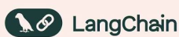
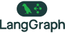
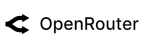
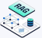
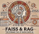

# Abner Machado

Engenheiro de software independente, focado em IA aplicada e open source.
Construo produtos SaaS de ponta a ponta e prefiro ferramentas abertas,
auto-hospedaveis e padroes que nao prendem o projeto a um fornecedor.

Meu objetivo e simples: transformar uma ideia em software que roda em
producao, com codigo limpo, mantido por uma pessoa so e sem lock-in.

## Areas de atuacao

- Produtos SaaS completos: arquitetura, backend, deploy e iteracao continua.
- Sistemas RAG: ingestao, chunking, embeddings e recuperacao sobre bancos vetoriais.
- Serving de LLMs: modelos locais com Ollama e vLLM; APIs via OpenRouter e LiteLLM.
- Agentes e orquestracao: LangChain, LangGraph e Model Context Protocol (MCP).

## Como trabalho

- Open source primeiro. Solucao proprietaria so com vantagem tecnica clara.
- Menor interferencia: a mudanca minima que resolve, sem reescrever o que funciona.
- Decisao guiada por custo, manutencao e risco de dependencia, nao por hype.
- Codigo aberto sempre que possivel, para que outros possam auditar e reusar.

## Stack

### Orquestracao e agentes

<table>
  <tr>
    <td></td>
    <td></td>
    <td></td>
    <td></td>
  </tr>
</table>

### Modelos e serving

<table>
  <tr>
    <td></td>
    <td></td>
    <td></td>
    <td></td>
    <td></td>
  </tr>
</table>

### RAG e embeddings

<table>
  <tr>
    <td></td>
    <td></td>
  </tr>
</table>

### Bancos vetoriais

<table>
  <tr>
    <td></td>
    <td></td>
    <td></td>
    <td></td>
    <td></td>
  </tr>
</table>

## Filosofia

Acredito em software livre e em construir na aberta. Ferramenta que da pra
rodar na sua propria maquina, ler o codigo e adaptar vale mais do que caixa
preta conveniente. Aberto a colaboracao em projetos open source.
