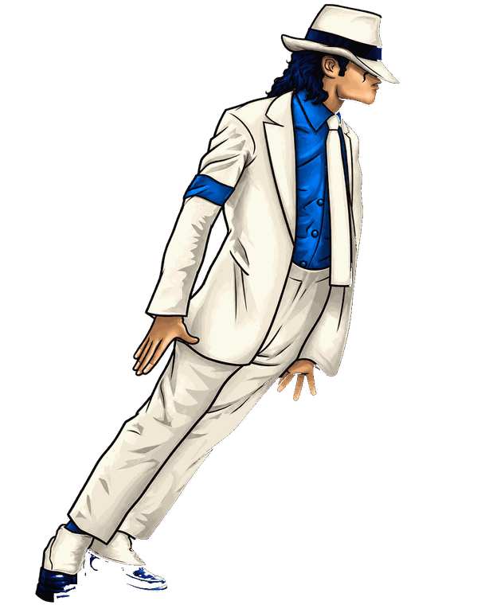
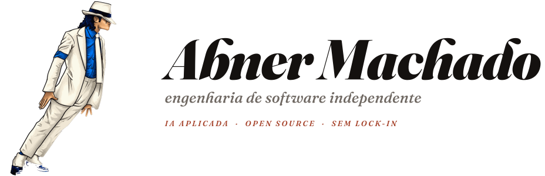
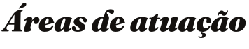
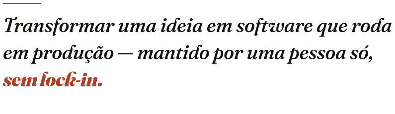
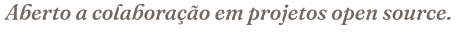

<table><tr>
<td valign="middle" width="34%">

</td>
<td valign="middle" width="66%">

<picture>
  <source media="(prefers-color-scheme: dark)" srcset="assets/hero-escuro.svg">
  
</picture>

</td>
</tr></table>

Construo produtos SaaS de ponta a ponta e prefiro ferramentas abertas, auto-hospedáveis
e padrões que não prendem o projeto a um fornecedor.

 

<picture>
  <source media="(prefers-color-scheme: dark)" srcset="assets/h-atuacao-escuro.svg">
  
</picture>

- **Produtos SaaS completos** — arquitetura, backend, deploy e iteração contínua.
- **Sistemas RAG** — ingestão, chunking, embeddings e recuperação sobre bancos vetoriais.
- **Serving de LLMs** — modelos locais com Ollama e vLLM; APIs via OpenRouter e LiteLLM.
- **Agentes e orquestração** — LangChain, LangGraph e Model Context Protocol (MCP).

 

<picture>
  <source media="(prefers-color-scheme: dark)" srcset="assets/h-trabalho-escuro.svg">
  
</picture>

- **Open source primeiro.** Solução proprietária só com vantagem técnica clara.
- **Menor interferência.** A mudança mínima que resolve, sem reescrever o que funciona.
- **Decisão por custo, manutenção e risco de dependência** — não por hype.
- **Código aberto sempre que possível**, para que outros possam auditar e reusar.

 

<picture>
  <source media="(prefers-color-scheme: dark)" srcset="assets/citacao-escuro.svg">
  
</picture>

 

<picture>
  <source media="(prefers-color-scheme: dark)" srcset="assets/h-stack-escuro.svg">
  
</picture>

<table>
<tr>
<td valign="top" width="50%">

<picture>
  <source media="(prefers-color-scheme: dark)" srcset="assets/s-agentes-escuro.svg">
  
</picture>

`LangChain` · `LangGraph` · `MCP` · `Claude Code`

</td>
<td valign="top" width="50%">

<picture>
  <source media="(prefers-color-scheme: dark)" srcset="assets/s-modelos-escuro.svg">
  
</picture>

`Ollama` · `vLLM` · `LiteLLM` · `OpenRouter` · `Hugging Face`

</td>
</tr>
<tr>
<td valign="top">

<picture>
  <source media="(prefers-color-scheme: dark)" srcset="assets/s-rag-escuro.svg">
  
</picture>

`chunking` · `embeddings` · `reranking` · `avaliação`

</td>
<td valign="top">

<picture>
  <source media="(prefers-color-scheme: dark)" srcset="assets/s-vetorial-escuro.svg">
  
</picture>

`pgvector` · `Qdrant` · `ChromaDB` · `FAISS` · `Milvus`

</td>
</tr>
</table>

 

<picture>
  <source media="(prefers-color-scheme: dark)" srcset="assets/h-filosofia-escuro.svg">
  
</picture>

Acredito em software livre e em construir na aberta. Ferramenta que dá pra rodar na sua
própria máquina, ler o código e adaptar vale mais do que caixa preta conveniente.

 

<picture>
  <source media="(prefers-color-scheme: dark)" srcset="assets/rodape-escuro.svg">
  
</picture>

Tipografia <a href="https://github.com/undercasetype/Fraunces">Fraunces</a> (SIL Open Font License 1.1), convertida em contornos SVG — o GitHub remove CSS do README, então fonte própria só entra como vetor.
